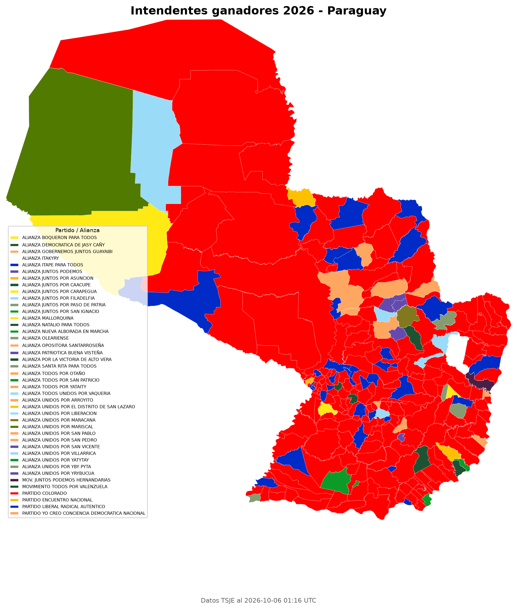

# Intendentes PY 2026

Mapa coroplético de los **ganadores a intendente** en las elecciones municipales
de Paraguay 2026: se toma el portal preliminar del TSJE, se une cada distrito
con su polígono censal y se pinta cada uno de los **263 distritos** con el color
oficial del partido ganador.

| | |
| --- | --- |
| **Fuente electoral** | [resultados.tsje.gov.py](https://resultados.tsje.gov.py) — elección `47`, candidatura `1` (INTENDENTE MUNICIPAL) |
| **Fuente de polígonos** | `DISTRITOS_PY_CNPV2022.geojson` (263 distritos, censo 2022) |
| **Resultado nacional** | PARTIDO COLORADO 187/263 (71.1%) · PLRA 34 (12.9%) · Yo Creo 3 · 39 alianzas locales con 1 c/u |
| **Demo publicada** | https://gillopy.github.io/Intendentes_py_2026/ |



> Imagen estática generada por `make_choropleth.py` en `output/choropleth_intendentes_2026.png`.

---

## 🚀 Inicio rápido

**Requisito:** [uv](https://docs.astral.sh/uv/) (maneja Python y dependencias; si
falta, uv baja la versión de Python que haga falta).

### 1. Instalar dependencias

```powershell
uv sync
```

Instala todo, incluido Playwright. Ese es el único paso necesario si solo vas a
generar el mapa con los datos ya incluidos.

### 2. (Solo si vas a scrapear) instalar el navegador

```powershell
uv run playwright install chromium
```

### 3a. Generar el mapa con los datos ya versionados (sin scrapear)

Los resultados ya están en `data/raw_results.json`, así que no hace falta tocar
el portal:

```powershell
uv run python make_choropleth.py
```

### 3b. Actualizar los datos desde el TSJE y regenerar

```powershell
uv run python scrape.py          # ~1-3 min, secuencial y respetuoso
uv run python make_choropleth.py
```

`make_choropleth.py` imprime un reporte de join y **sale con error si algún
distrito no matcheó** (esperado: `263/263`).

---

## 🧭 ¿Cuándo necesitás Playwright?

Playwright queda instalado siempre (es dependencia principal), pero **solo se
usa** cuando scrapeás. El mapa se puede generar sin tocar la red:

| Tarea | ¿Ejecuta Playwright? | Por qué |
| --- | --- | --- |
| Generar el mapa desde `data/raw_results.json` | ❌ No | `make_choropleth.py` solo lee JSON + geojson y dibuja |
| Volver a scrapear el TSJE | ✅ Sí | Hay que pasar el challenge Sucuri y hacer 263 fetches same-origin |
| Cambiar de elección/candidatura | ✅ Sí | implica volver a scrapear |

`scrape.py` **no trae los datos embebidos**: es el programa que los consigue.
Playwright es el motor que abre el navegador, pasa el firewall y ejecuta los
`fetch` con las cookies de la sesión.

---

## 🛠️ Troubleshooting

| Error | Causa | Solución |
| --- | --- | --- |
| `ModuleNotFoundError: No module named 'playwright'` | El entorno quedó sin Playwright (p. ej. un `uv sync` viejo o un venv a medias) | `uv sync` (Playwright ya es dependencia principal) |
| `[warn] blocked (attempt 1): Sucuri...` seguido de cuelgue en `checkbox.click()` | El challenge humano de Sucuri tardó en cargar | Dejalo ~30 s; el scraper reintenta solo. No cortes con Ctrl+C |
| `KeyboardInterrupt` + `TargetClosedError` | Cortaste el scraper con Ctrl+C mientras resolvía el challenge | Volvé a correr `uv run python scrape.py` |
| `uv run playwright install chromium` no hace nada | Se corrió sin Playwright instalado | Primero `uv sync`, después `uv run playwright install chromium` |

---

## 📦 Qué genera

| Salida | Descripción |
| --- | --- |
| `site/` | Sitio estático publicado: mapa coroplético interactivo + unit grid, dona y barras por departamento |
| `site/assets/data.js` | Datos + geometría simplificada que consume el sitio (generado) |
| `output/choropleth_intendentes_2026.png` | Mapa estático (matplotlib) pintado por color del ganador + leyenda |
| `output/resumen_partidos.csv` | Distritos ganados por partido (conteo + %) |
| `data/raw_results.json` | Scrape crudo: candidatos, ganador y totales por distrito |

---

## 🎨 El sitio

`site/index.html` es un sitio estático sin dependencias (HTML + CSS + JS vanilla,
tipografía vendorizada) que se abre directo desde el disco o se publica en Pages:

- **Mapa coroplético** interactivo: hover/tap por distrito, zoom con la rueda,
  búsqueda de municipio y ficha con el intendente electo.
- **Unit grid** de 263 cuadros (uno por municipio) y **dona** con el reparto nacional.
- **Barras por departamento** con el % de distritos ganados por cada categoría.
- **Votos por fuerza** (ANR / Oposición / Alianzas): la ANR ganó el 71% de los
  municipios pero reunió ~53% de los votos.
- Toggle **4 categorías / Todos los partidos** (color oficial de las 42 fuerzas).

Se abre sin servidor: `site/index.html`. Para servirlo local:

```powershell
uv run python -m http.server 8123 --directory site
```

---

## 🌐 Publicación (GitHub Pages)

El workflow `.github/workflows/deploy-pages.yml` corre en cada push a `main` y
publica el sitio estático desde **`site/`**. `site/index.html` y `site/assets/`
se versionan, así que la demo se actualiza sola al commitear los cambios.

---

## 📁 Estructura del proyecto

```text
scrape.py                            Scraper Playwright        -> data/raw_results.json
make_choropleth.py                   Join + render             -> site/assets/data.js, output/*
site/                                Sitio estático publicado (HTML/CSS/JS, sin dependencias)
DISTRITOS_PY_CNPV2022.geojson        Polígonos censales (input)
test_scrape.py                       Prueba mínima del challenge Sucuri + API
data/raw_results.json                Datos ya scrapeados (versionados)
output/                              Artefactos generados (PNG, CSV, geojson)
.github/workflows/deploy-pages.yml   Publica site/ en GitHub Pages
pyproject.toml / uv.lock             Dependencias (uv)
```

---

## 🔧 Escalar / adaptar

### Cambiar de elección o candidatura

El portal es data-driven. Editá las dos constantes al inicio de `scrape.py`:

```python
ELECCION   = "47"   # 47 = ELECCIONES MUNICIPALES 2026
CANDIDATURA = "1"   # 1 = INTENDENTE MUNICIPAL (2 = JUNTA MUNICIPAL)
```

Los ids válidos salen del propio portal:

- `/publicacion/statics/json/divulgacion/elecciones.js`
- `/publicacion/statics/json/divulgacion/candidaturas.js`

El resto (distritos, departamentos, forma de la API) se lee dinámicamente, así
que el mismo pipeline sirve para otros cargos o elecciones futuras sin tocar el
código.

### Usar otro conjunto de polígonos

`make_choropleth.py` espera un `FeatureCollection` con las propiedades
`DPTO`, `DPTO_DESC`, `DISTRITO`, `DIST_DESC_`, `CLAVE`. Si cambiás la fuente,
ajustá el join por nombre en `make_choropleth.py`. El script acepta el archivo
como `DISTRITOS_PY_CNPV2022.geojson` o `DISTRITOS_PY_CNPV2022.geojson.txt`.

### Performance

El scrape es secuencial a propósito (~0.2 s entre requests, con reintento). 263
distritos tardan 1-3 minutos. Para volumen mayor, respetá el rate limit del
portal antes de paralelizar.

---

## ⚠️ Gotchas que hay que conocer

1. **Los códigos de departamento están permutados** entre las dos fuentes. En el
   geojson censal `16 = BOQUERON` y `17 = ALTO PARAGUAY`, pero en el TSJE es al
   revés. Unir por código intercambia dos departamentos enteros — el mapeo
   explícito está en `tsje_dep_to_geo()`.
2. **Los códigos de distrito NO coinciden** (geojson `02 BELEN` vs TSJE
   `1-BELEN`), así que los distritos se unen **por nombre**, nunca por código.
3. **Variantes de nombre** se resuelven con normalización de acentos, limpieza
   de puntuación, abreviaturas (`GRAL → GENERAL`, `DR → DOCTOR`, `PTO → PUERTO`,
   …), un mapa de alias y asignación 1:1 por mejor score dentro de cada
   departamento. Los conteos por departamento son una biyección exacta (263 = 263).
4. **Corrupción en la fuente:** el geojson censal guarda la `Ñ` como `??` literal
   en dos nombres (`MAYOR JULIO DIONISIO OTA??O`, `DR. RAUL PE?A`); el alias
   lleva la forma corrupta tal cual.
5. **Challenge Sucuri:** el control "Verify you're human" es un
   `<div role="checkbox">` custom (`cap-widget`) cuyo `aria-checked` nunca
   cambia; `.check()` de Playwright falla. El scraper usa `.click()` + reintentos.

---

## 📝 Notas

- El portal a veces devuelve una variante "Access Denied"; el loop de reintentos
  la absorbe.
- Dos distritos reportan ganador con 0 votos: refleja el payload de origen (todos
  los candidatos en 0), no un bug de parseo.
- `resumen_partidos.csv` está en UTF-8 **sin BOM**, así que Excel puede mostrar
  mal las `Ñ`. Usá un editor que respete UTF-8, o re-guardá con BOM.
- El sitio simplifica la geometría censal (Douglas-Peucker adaptativo) antes de
  embeberla, así que `site/assets/data.js` pesa ~0,4 MB en lugar de los ~44 MB del
  geojson censal original (`DISTRITOS_PY_CNPV2022.geojson`, el único geojson que se
  versiona: es el input del join).

## Licencia

Los datos pertenecen al TSJE (resultados) y al censo 2022 (polígonos). El código
de este repositorio se ofrece tal cual, con fines analíticos.
